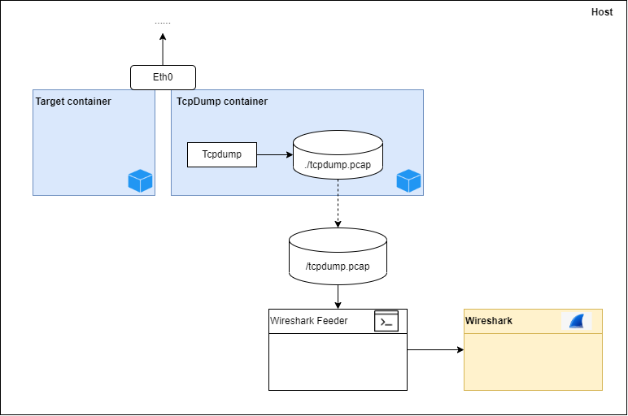
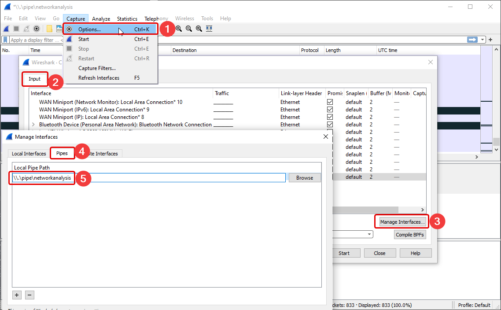
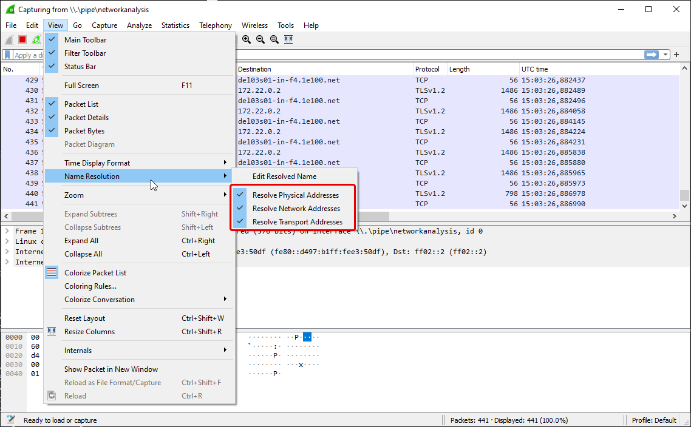

# What is it?

This repository demontrates how to setup a local environment to capture the Docker container's network traffic with Wireshark in realtime.

*I do not have much experience in Docker network or network in general, the setup is the best I can think of for my personal use.*

# Up and down side?

### Overview

### The upside
1. The target container connects to a user-defined network. It isolates the target container's network traffic.
2. Another container built from [`kaazing/tcpdump`](https://hub.docker.com/r/kaazing/tcpdump) connects to the target container with [`container` network mode](https://docs.docker.com/engine/reference/run/). By doing that, it helps to not capture packets not relating to the target container.
3. A console application `Wireshark Feeder` forwards packets from the file `/tcpdump.pcap` to [`Wireshark`](https://www.wireshark.org/) via [named pipe](https://wiki.wireshark.org/CaptureSetup/Pipes.md), so I can view packets on Wireshark in **realtime**.

Actually, Wireshark can directly open the file `/tcpdump.pcap` but then it will not be refreshing automatically to follow to packets being captured by tcpdump. Moreover, I want to explore the ability of feeding packets to Wireshark over named pipe. 

### The downside
There is a file `/tcpdump.pcap` getting larger over time as long as the `tcpdump container` runs.

# How to run it?

1. Download and install necessary programs: [Wireshark](https://www.wireshark.org/download.html), [Docker](https://www.docker.com/products/docker-desktop/), [.NET SDK 5.0](https://dotnet.microsoft.com/en-us/download/dotnet/5.0).
2. To start, execute the script `Start.ps1`.
3. To stop, execute the script `Stop.ps1`

# Next

- [ ] Create my own docker image of tcpdump.

# Side notes

1. Visually config Wireshark to capture a named pipe.

2. Enable resolve host name in Wireshark.

# Reference

https://hub.docker.com/r/kaazing/tcpdump \
https://wiki.wireshark.org/CaptureSetup/Pipes \
https://www.tcpdump.org/manpages/tcpdump.1.html \
https://gist.github.com/unitycoder/a82365a93c9992f7f9631741fe007e9d \
https://docs.docker.com/engine/reference/run/ \
https://community.pivotal.io/s/article/Explaining-Four-Basic-Modes-of-Docker-Network?language=en_US
