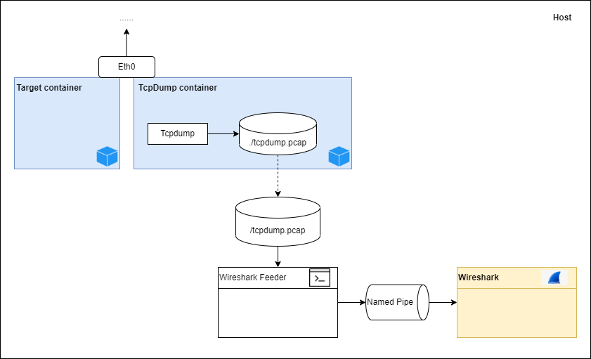

# What is it?

This repository demontrates how to setup a local environment to capture the Docker container's network traffic with Wireshark in realtime.

*I do not have much experience in Docker network or network in general, the setup is the best I can think of for my personal use.*

# Up and down side?

### Overview


### The upside
1. I pull a tcpdump image from [`kaazing/tcpdump`](https://hub.docker.com/r/kaazing/tcpdump), start a container and then connect it to the target container with [`container` network mode](https://docs.docker.com/engine/reference/run/). By doing that, it helps to not capture packets not relating to the target container.
2. I create a console application `Wireshark Feeder` which forward packets from the file `/tcpdump.pcap` to [`Wireshark`](https://www.wireshark.org/) via [named pipe](https://wiki.wireshark.org/CaptureSetup/Pipes.md), so I can view packets on Wireshark in realtime.

Actually, Wireshark can directly open the file `/tcpdump.pcap` but then it will not be refreshing automatically to follow to packets being captured by tcpdump. Moreover, I want to explore the ability of feeding packets to Wireshark over named pipe. That's why I made up this repository.

### The downside
There is a file `/tcpdump.pcap` getting larger over time as long as the `tcpdump container` runs.

# How to run it?

```
docket network create network-analysis

docker build --progress=plain --no-cache -t sample-app -f Dockerfile .
docker run -it --name sample-app-container --network network-analysis --rm sample-app  

docker run --name tcpdump -d --rm --net container:sample-app-container -v $PWD/Docker_TCPDump:/tcpdump kaazing/tcpdump:latest -vv -i any -w /tcpdump/tcpdump.pcap -U --immediate-mode
```

# Reference


https://github.com/kaazing/dockerfiles/blob/master/tcpdump/Dockerfile
